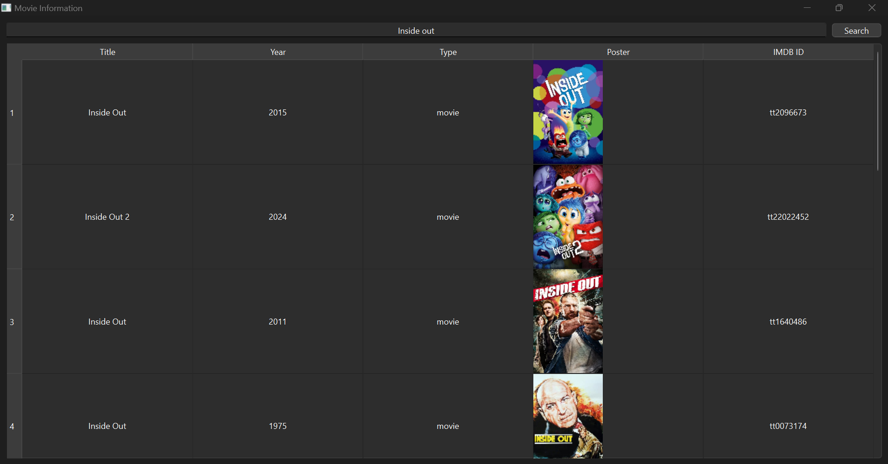

# Movie Information App

Dieses Projekt ist eine Anwendung zur Anzeige von Informationen über Filme, TV-Serien und Videospiele. Die Anwendung ermöglicht es dem Benutzer, nach Titeln zu suchen und detaillierte Informationen wie Titel, Jahr, Typ, Poster und IMDB-ID anzuzeigen.

## Funktionen

- Suche nach Filmen, TV-Serien und Videospielen
- Anzeige von Titel, Jahr, Typ, Poster und IMDB-ID
- Automatische Anpassung der Bildgröße und des Seitenverhältnisses
- Unterstützung für OMDB, TMDB und RAWG APIs

## Anforderungen

- Python 3.x
- PyQt6
- requests
- python-dotenv

## Installation

1. Klone das Repository:
   ```bash
   git clone https://github.com/dein-benutzername/movie-information-app.git
   ```
2. Wechsle in das Projektverzeichnis:
   ```bash
   cd movie-information-app
   ```
3. Installiere die Abhängigkeiten:
   ```bash
   pip install -r requirements.txt
   ```
4. Erstelle eine `.env` Datei im Projektverzeichnis und füge deine API-Schlüssel hinzu:
   ```env
   OMDB_API_KEY=dein_omdb_api_key
   TMDB_API_KEY=dein_tmdb_api_key
   RAWG_API_KEY=dein_rawg_api_key
   ```

## Verwendung

1. Starte die Anwendung:
   ```bash
   python main.py
   ```
2. Gib den Titel eines Films, einer TV-Serie oder eines Videospiels in die Suchleiste ein und klicke auf "Search".

## Screenshot


